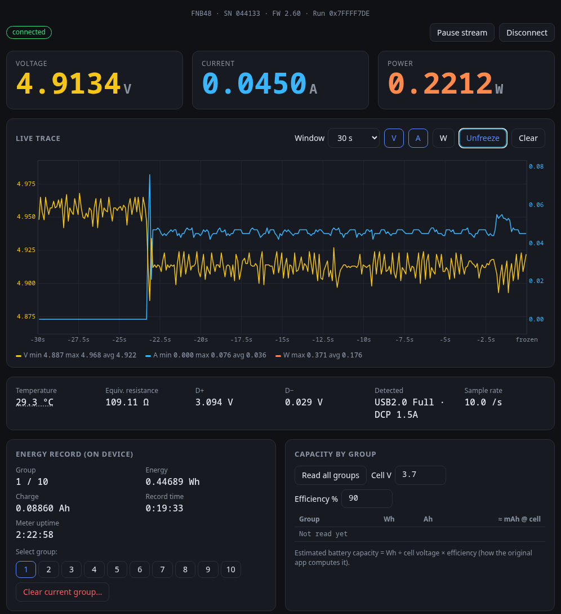

# FNB48 Web Bluetooth frontend

A browser replacement for the FNIRSI FNB48 Android app since that doesn't seem to work any more. It talks to the meter directly over Web Bluetooth.
For the reverse-engineered protocol, see [PROTOCOL.md](PROTOCOL.md). All work came from Claude Code disassembling the APK to recreate the specs and implement it.

Live web app (PWA) that can bn installed on your phone: https://capnbry.github.io/fnb48-web/



## Features

* Live voltage, current and power (0.1 mV / 0.1 mA), plus temperature, equivalent resistance, D+/D− and the detected charge protocol
* Live V/A/W trace with selectable windows (10 s to 1 h), min/max/avg, hover readout and freeze
* On-device energy groups: switch groups, clear a group, and read every group's Wh/Ah with a battery-capacity estimate
* Fast-charge trigger (QC2.0, QC3.0, FCP, AFC)
* Voltage and current alarms (highlight and/or beep)
* Record to CSV

## Run it locally

```sh
python3 -m http.server 8000 --directory web
```

Then open <http://localhost:8000> in Chrome or Edge and click **Connect**.

* **Linux desktop:** Web Bluetooth is behind a flag. Enable `chrome://flags/#enable-experimental-web-platform-features`
  and restart the browser. BlueZ must be running.
* **Android:** Chrome supports Web Bluetooth natively, but the page has to come from HTTPS (for example, the Github Pages link above)
* Firefox and Safari don't support Web Bluetooth.

**Reconnecting on Linux:** BlueZ forgets an unpaired device about 30 s after it last heard it advertise, and Chrome then
reports "no longer in range". When that happens, Connect scans for up to 60 s (status **searching**, button **Cancel**)
and reconnects as soon as BlueZ hears the meter again, usually within 10–15 s. It only scans while that search is running.
To avoid the wait entirely, mark the meter as trusted once: run `bluetoothctl`, then `scan on`, then
`trust <meter address>`.

## CLI alternative

`fnb48.py` logs readings as CSV using [bleak](https://github.com/hbldh/bleak):

```sh
pip install bleak
./fnb48.py > log.csv           # 0.1 mV/mA readings at ~4 Hz
./fnb48.py --fast > log.csv    # 1 mV/mA samples at ~8-10 Hz
```
